# Watson Discovery for Content Insights

This walkthrough is a subset of the code pattern presented here - https://developer.ibm.com/patterns/create-an-app-to-perform-intelligent-searches-on-data/. Showing you how to investigate a desired set of unstructured documents using Watson Discovery service instance. The code pattern provides a working example of a web application that queries and visualizes data from the Watson Discovery Service. This app provides examples of how to use the enrichments made by Discovery through the use of filters, lists and graphs. Some of the enrichments used by the application are:

* Entities - people, companies, organizations, cities, and more.
* Categories - classification of the data into a hierarchy of categories up to 5 levels deep.
* Concepts - identified general concepts that aren't necessarily referenced in the data.
* Keywords - important topics typically used to index or search the data.
* Sentiment - the overall positive or negative sentiment of each document.


## UI controls and associated actions

1. Search field and search parameters: Return results based on search criteria.
1. List Filters: Multiple drop-down lists of filters that are applied to the search resullts. Each drop down list contains entities, categories, concepts and keywords associated with the results. For each drop down filter item, the number of matches will also be displayed. If a user selects a filter item, a new search will be conducted and will update the results panel.
1. Search results and pagination menu: Shows a page of result items (e.g. 5 per page) and a pagination menu to allow the user to scroll through pages of result items. There will also be a drop-down menu that will allow the user to sort the entries based on date, score, and sentiment value.
1. Tag cloud filter: Similar to the list filters but in a different format. One set of filter items (either entities, categories, concepts or keywords) can be displayed at one time. User can select/deselect items in the cloud to turn on/off filters.
1. Trend chart: Chart to show the sentiment trend for a specific entity, category, concept, or keyword over time. The data will reflect the current matching result set.
1. Sentiment chart: Donut chart that shows the total percentages of postive, neutral and negative reviews of selected entities, categories, concepts, or keywords. The data will reflect the current matching result set.

# Lab Flow

1. [Setup your environment](#environment-setup)
1. [Run the sample application](#run-the-application)

## Environment Setup

1. Clone this `Watson Discovery UI` repository locally. In a terminal, run:

   ```
   $ git clone https://github.com/jrtorres/watson-discovery-ui.git
   ```

1. Go to the IBM Cloud Console - (https://console.bluemix.net) and log in.

1. **Click on the Catalog** link in the top-left corner of the IBM Cloud dashboard. Then **Select the AI category** on the left, under 'All Categories'. Finally, click on the **Discovery** service tile.  
   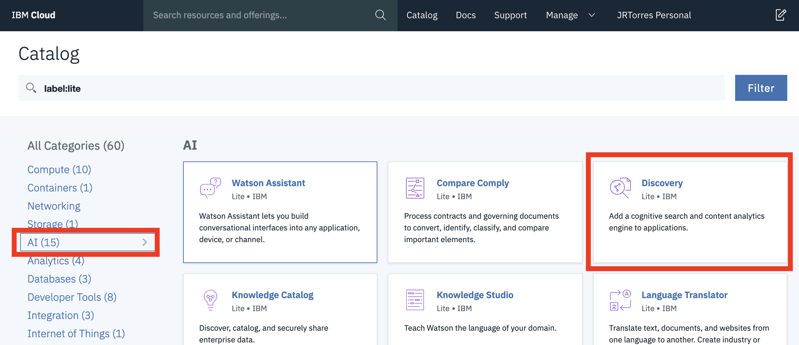

1. Click **Create** (*Leave default options for Lite plan, region service name, etc*)
   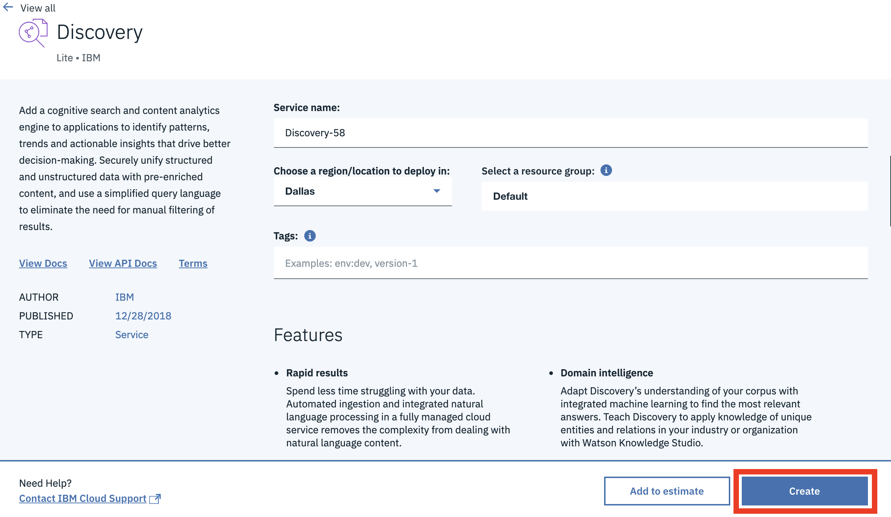

1. From the `Resource list` page, click on the name discovery service you just created (*Note: It may take a couple of minutes to provision the service*)
   

1. Click on the  **Launch tool** button to launch into the Watson Discovery tooling.
   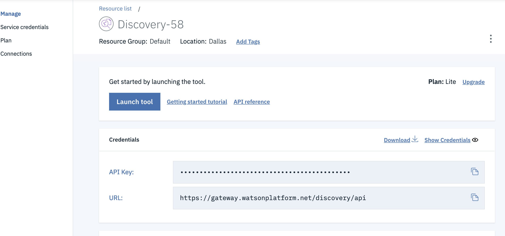

1. On the tooling landing page, you have the option to use pre-enriched and ingested content that comes out of the box with discovery (news related content source) or to add your own content. **Click the 'Upload your own data'** button on the top left of the page.  If you are presented with a message about Lite Plan being for trial & experimentation, go ahead and click on `Set up with current plan` and click `Continue`. This message is to inform you that Lite plans are not intended for production usage scenarios. At this point, the environment and back end resources are being set up for your content.  

1. In the collection details dialog window, give your collection a name (i.e 'Test Data') and **click the Create** button. 
   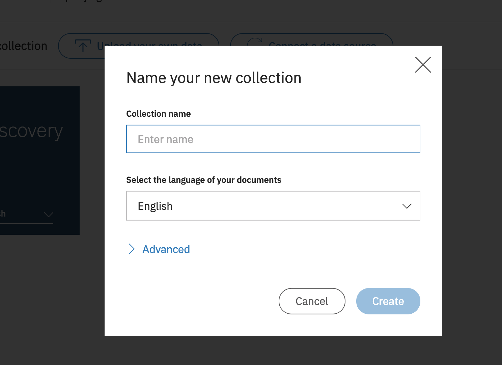

1. Before we add content, lets add some more enrichments that the UI will expect. Click on the **Configure data** option on the top right. The configuration is where we can control how the data is converted, what gets indexed and what enrichments get applied.
   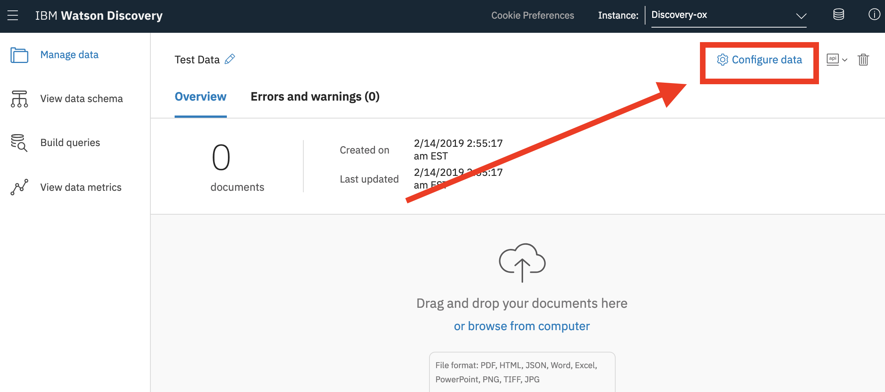

1. Now click on the **`Add enrichments`** option.
   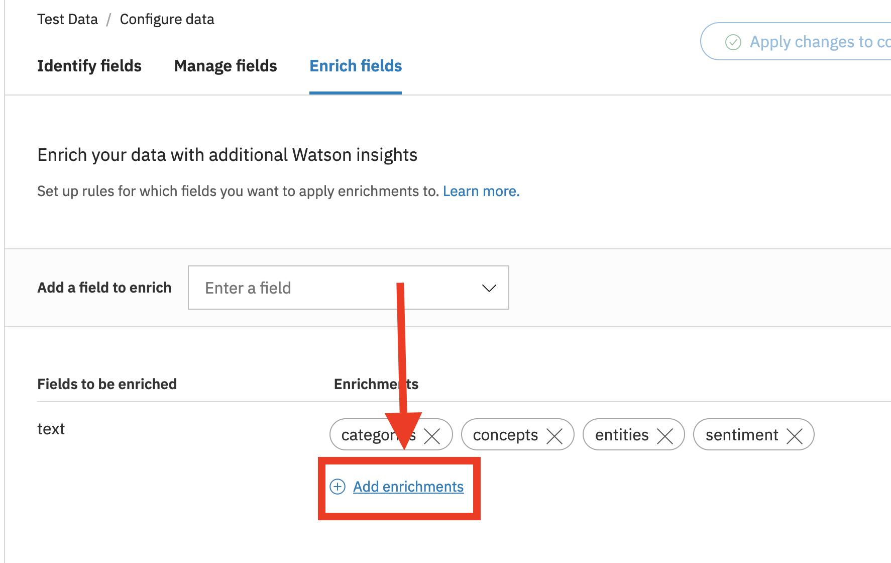

1. In the enrichment selection window, we want to add keywords and emotion. Click the **`Add`** button inside the `Keyword Extraction` and `Emotion Analysis` tiles. Then click on the **`Done`** button on the bottom of the dialog.
   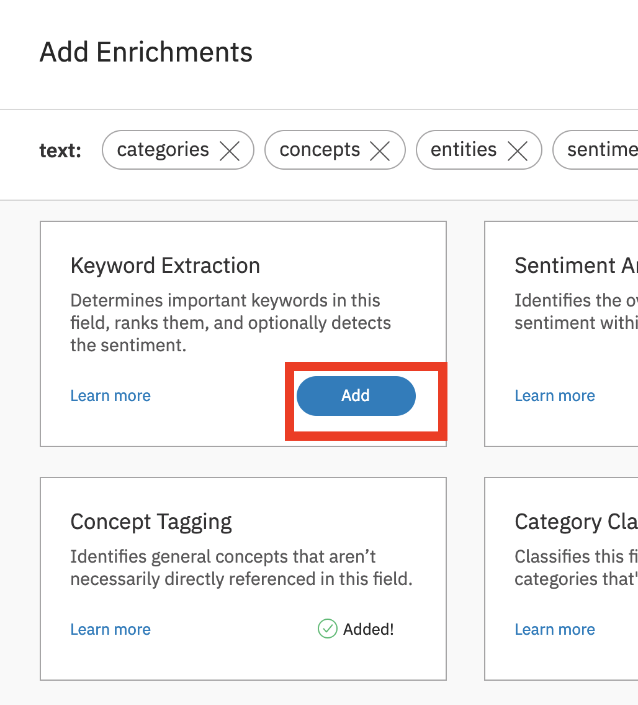

1. Now click on the **`Apply changes to collection`** button. You can close the dialog window to upload documents and then click on `Manage data` on the left panel to go back to your collections..
   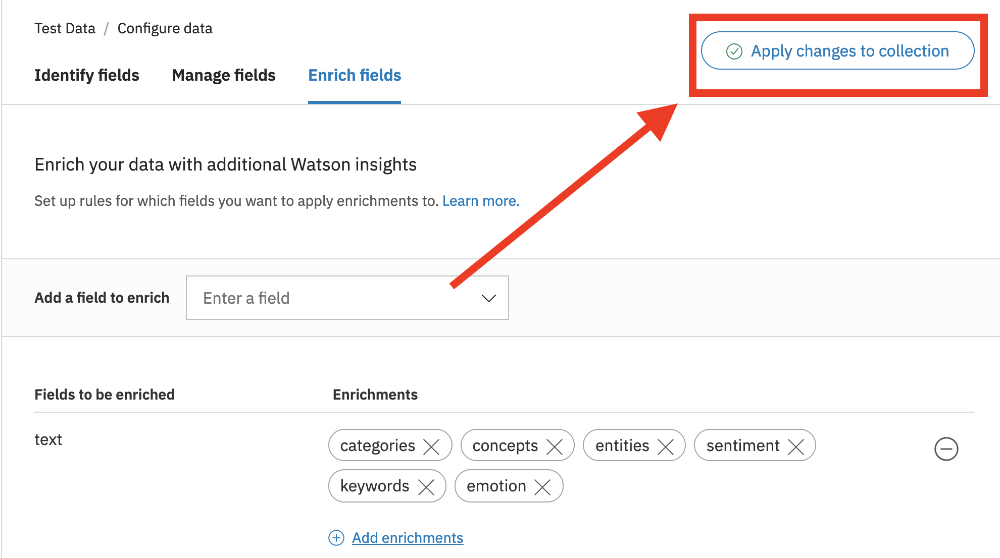

1. In the center of the collection landing page, select **or browse from computer** link to start uploading content.  
   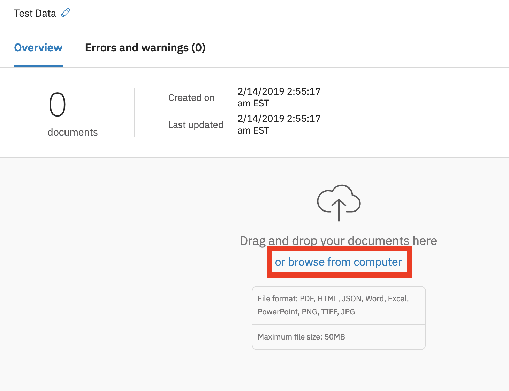

1. For the purpose of this lab, we have provided several data sets for you to select from. Each of the data sets contains documents already in JSON format that are in the **`data/`** directory of the repository. From the file section dialog, find the directory with these files and select  the JSON files and **click on the 'Open'** button. *Note: Each dataset contains approximately 1000 documents, which is the limit for a lite plan of Watson Discovery. The documents may be in a zip file, unzip them before uploading, then start by uploading a couple hundred of the documents* 
   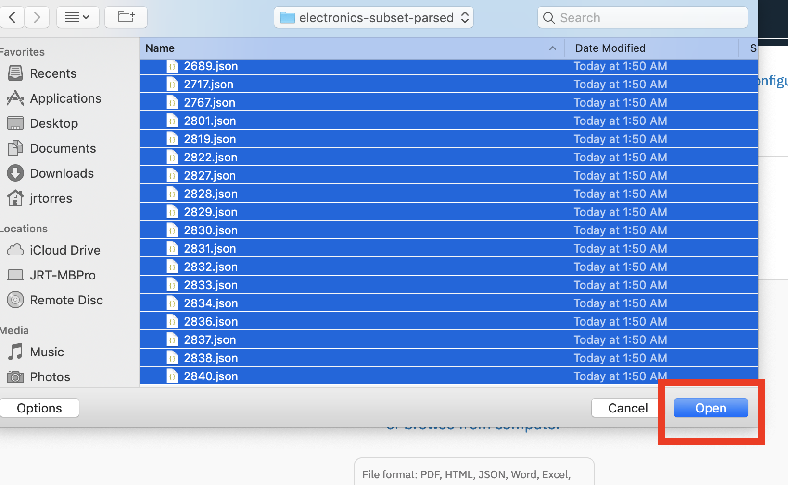

1. As the content is uploading, you should be taken back to the collection landing page. There should be no errors indicated on the landing page and an indicator next to the document count to show that content is still processing. 
   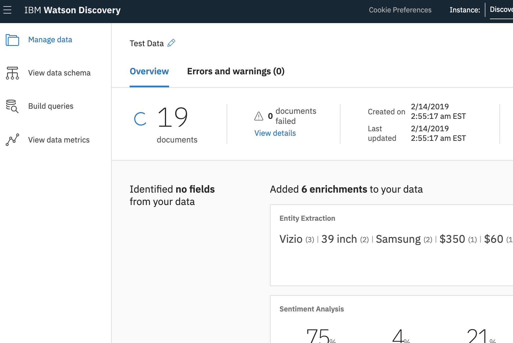

1. Once all the content is uploaded (the progress indicator next to document count disappears), feel free to run searches on the indexed content. **Click on the Build Queries** icon on the left side of the page.  

1. Start with a simple query to filter the results to those with negative sentiment:
   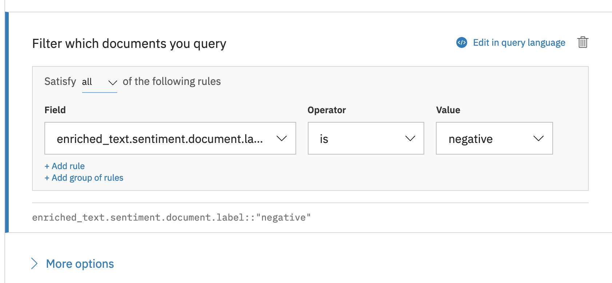

1. Run an analysis on top of the negative sentiment results:
   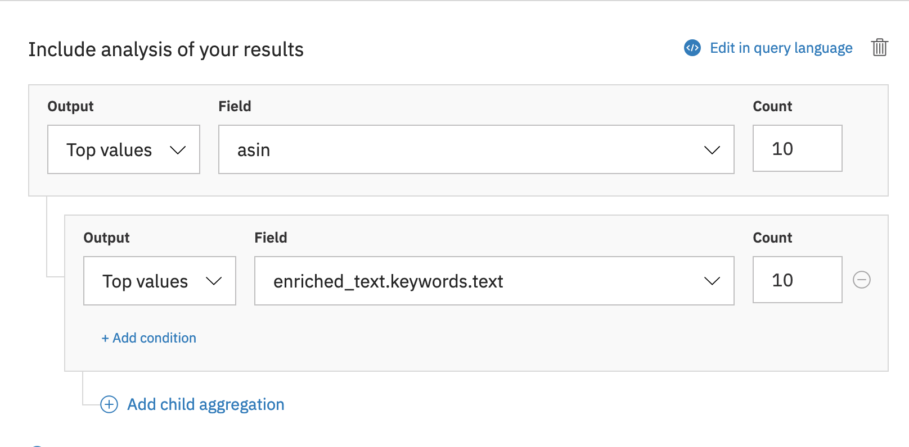

1. Feel free to try some more queries.

# Run the Application

1. Before we can run the application, we need to gather the id's for our instance and collection. From the collection landing page of the tooling, Click on the **`Api`** drop down on the top right of the screen. Copy and Save the **Collection Id** and the **Environment Id**
   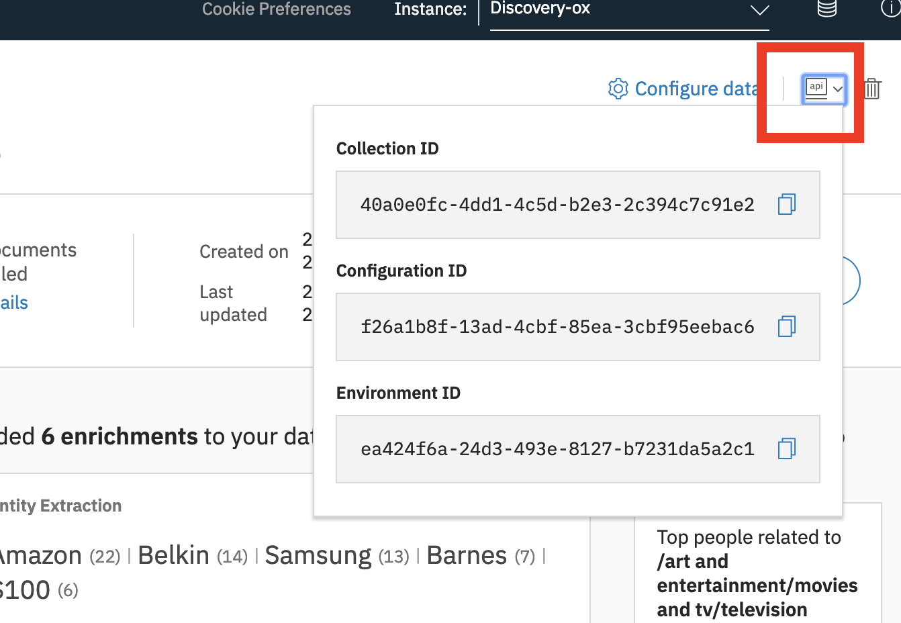

1. We also need to service credentials to access the discovery service. From the IBM Cloud console. Click on the name of the discovery service you created. Copy the API Key and URL from the resource page.
   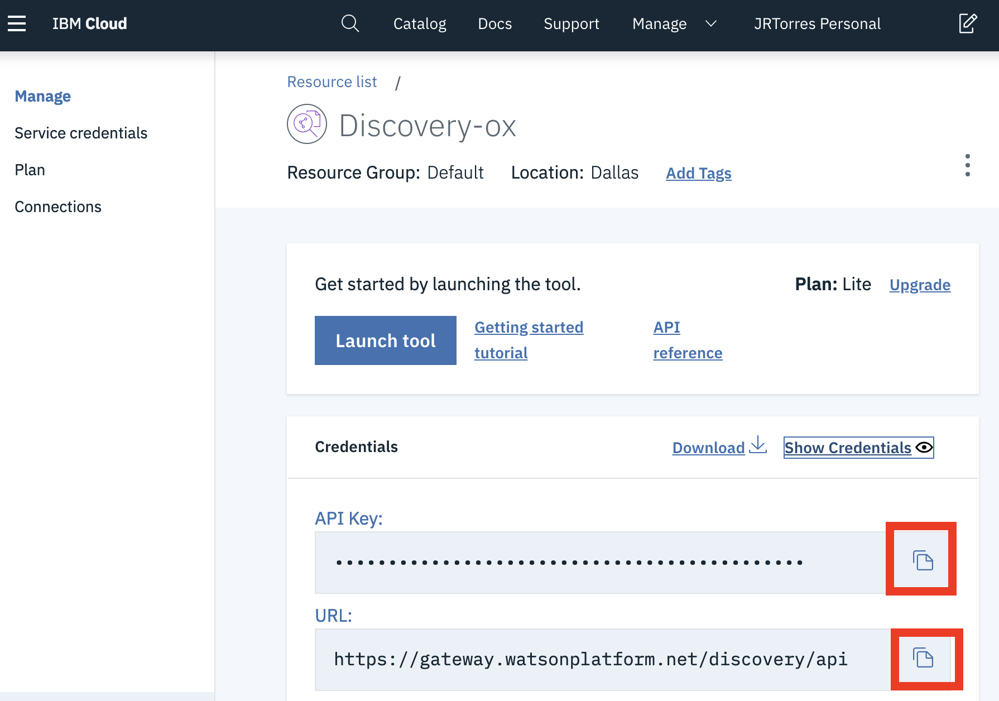

1. Open a terminal window and navigate to the application folder (where you have this Github Repo cloned).

1. Copy the *.env.example* file and create a file called *.env* where you will place the values you copied above.

    ```
    cp .env.example .env
    ```

1. Open the *.env* file and add the service credentials and model ID that you obtained in the previous step.

    Example *.env* file that configures the `apikey` and identifiers for a Watson Discovery service instance:

    ```bash
    # Watson Discovery
    DISCOVERY_URL=<add_discovery_url>
    DISCOVERY_ENVIRONMENT_ID=<add_discovery_environment_id>
    DISCOVERY_COLLECTION_ID=<add_discovery_collection_id>

    DISCOVERY_IAM_APIKEY=<add_discovery_iam_apikey>

    # Run locally on a non-default port (default is 3000)
    # PORT=3000
    ```

1. Save the file.

1. Install the dependencies. From the terminal window, run the following command:

    ```
    npm install
    ```

1. Run the application. From the terminal window, run the following command:

    ```
    npm start
    ```

1. View the application in a browser at `localhost:3000`.

# Links

* [Demo on Youtube](https://www.youtube.com/watch?v=5EEmQwcjUa4): Watch the video
* [Watson Node.js SDK](https://github.com/watson-developer-cloud/node-sdk): Download the Watson Node SDK.

# Learn more

* **Artificial Intelligence Code Patterns**: Enjoyed this Code Pattern? Check out our other [AI Code Patterns](https://developer.ibm.com/technologies/artificial-intelligence/)
* **AI and Data Code Pattern Playlist**: Bookmark our [playlist](https://www.youtube.com/playlist?list=PLzUbsvIyrNfknNewObx5N7uGZ5FKH0Fde) with all of our Code Pattern videos
* **With Watson**: Want to take your Watson app to the next level? Looking to utilize Watson Brand assets? [Join the With Watson program](https://www.ibm.com/watson/with-watson/) to leverage exclusive brand, marketing, and tech resources to amplify and accelerate your Watson embedded commercial solution.

# License

This code pattern is licensed under the Apache Software License, Version 2.  Separate third party code objects invoked within this code pattern are licensed by their respective providers pursuant to their own separate licenses. Contributions are subject to the [Developer Certificate of Origin, Version 1.1 (DCO)](https://developercertificate.org/) and the [Apache Software License, Version 2](https://www.apache.org/licenses/LICENSE-2.0.txt).

[Apache Software License (ASL) FAQ](https://www.apache.org/foundation/license-faq.html#WhatDoesItMEAN)
